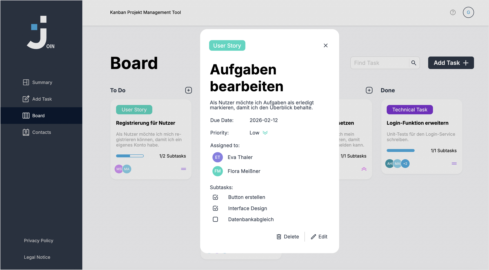

<h1 align="left">Join - Kanban Management Tool</h1>

###

Together with other participants from the Developer Akademie, a web app was built using HTML, CSS, JavaScript, Git, and Firebase. It serves as a project management tool to visualize the status and responsibilities of tasks. Subsequent maintenance and changes were implemented by me personally in this repository.
  

Join is part of the Developer Akademie's training programme for software developers (www.developerakademie.com). 
  

###

 

 

 

 

 

