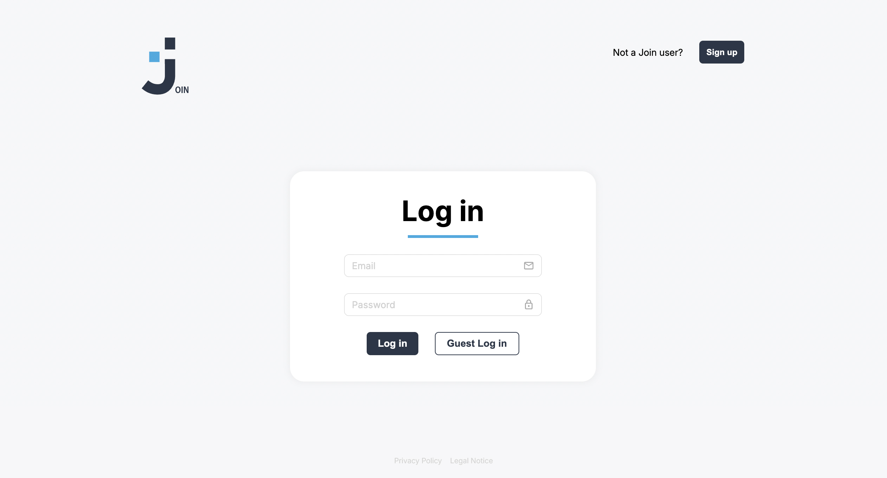
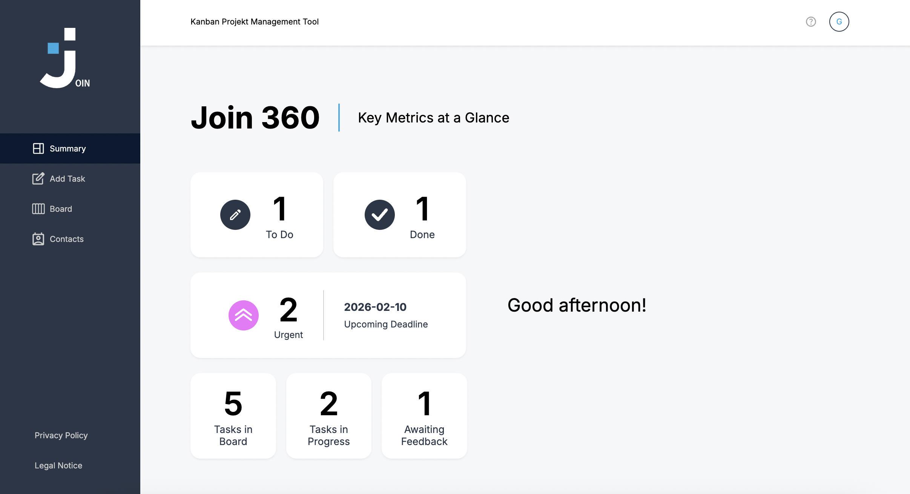
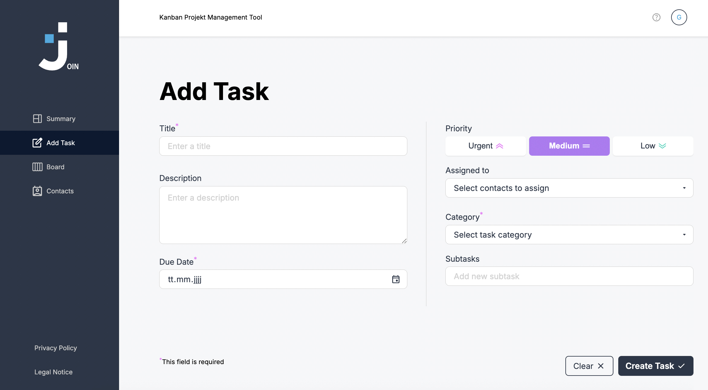
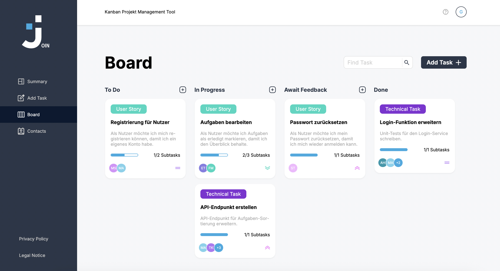
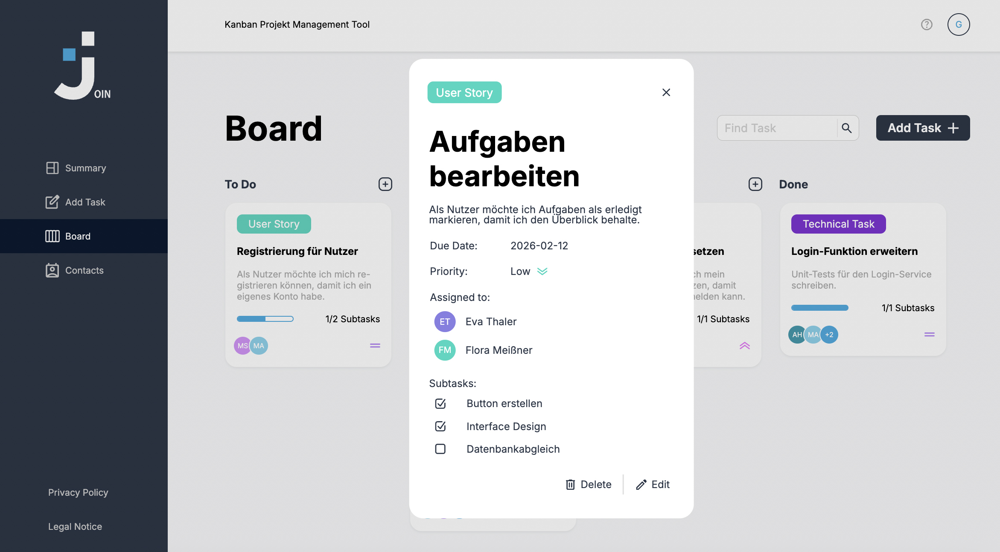
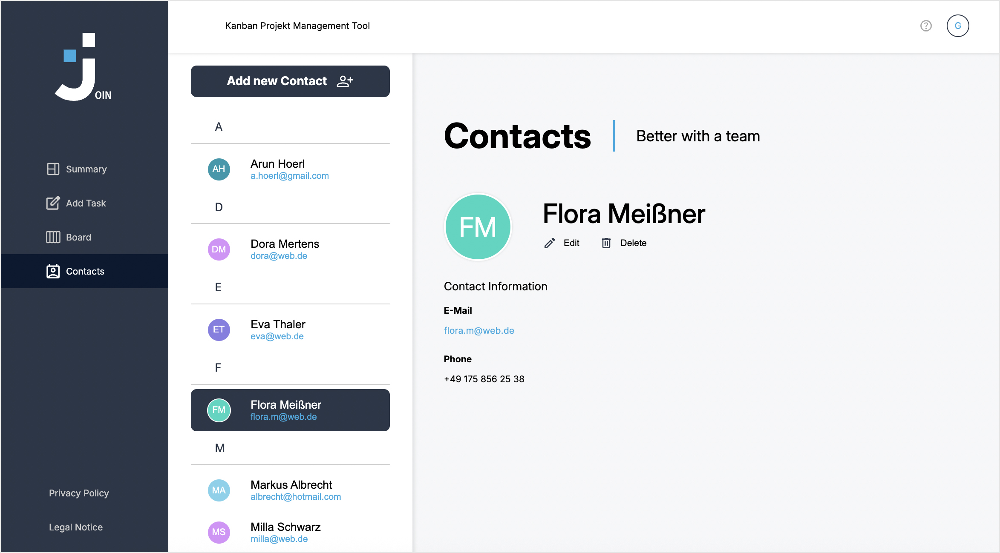

# Join – Kanban Management Tool

A browser-based project management tool built with HTML, CSS, JavaScript, and Firebase. Join visualizes the status and responsibilities of tasks in a Kanban-style board. The app was developed together with other participants from the Developer Akademie; subsequent maintenance and changes were implemented independently in this repository.

Join is part of the Developer Akademie's training programme for software developers ([www.developerakademie.com](https://www.developerakademie.com)).

[LIVE VIEW](https://join.karina-klages.de)








## Table of Contents

- [Prerequisites](#prerequisites)
- [Quickstart](#quickstart)
- [Project Structure](#project-structure)

## Prerequisites

No build tool or server required — just a modern browser. Firebase is used as the backend and is already configured in the project.

## Quickstart

Clone the repository:

```bash
git clone https://github.com/karinaklages/join.git
cd join
```

Then open `index.html` directly in your browser:

```text
join/index.html
```

## Project Structure

```text
join/
├── assets/
│   ├── fonts/             # Local font files
│   └── img/               # Images and screenshots
├── scripts/               # JavaScript modules and logic
├── styles/                # Modular stylesheets
├── templates/             # HTML template functions
├── .gitignore
├── add_task.html          # Add task page
├── board.html             # Kanban board page
├── contacts.html          # Contacts page
├── help.html              # Help page
├── index.html             # Application entry point (login)
├── legal_notice.html      # Legal notice page
├── privacy_policy.html    # Privacy policy page
├── sign_up.html           # Sign up page
├── summary.html           # Summary/dashboard page
├── script.js              # Core app logic
└── styles.css             # Main stylesheet
```